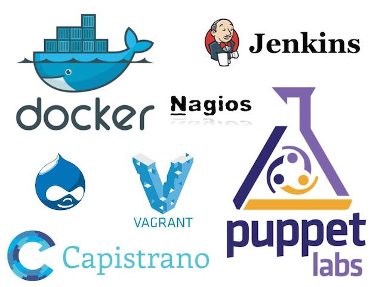
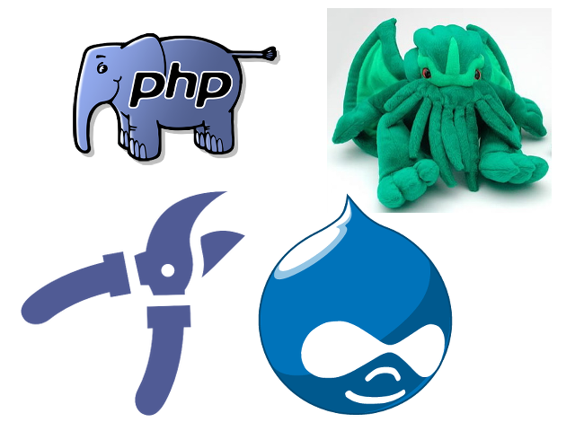
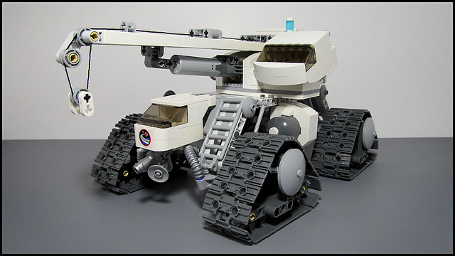
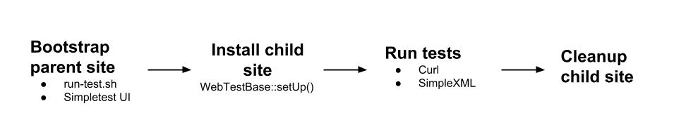
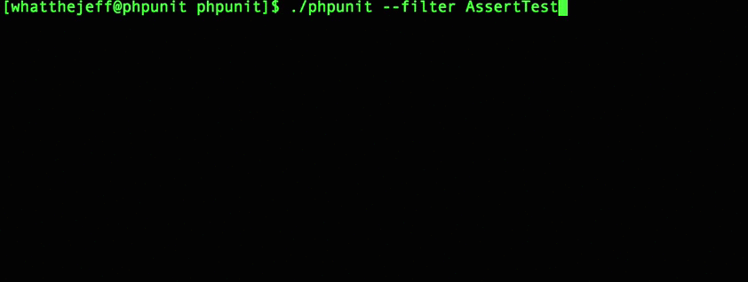
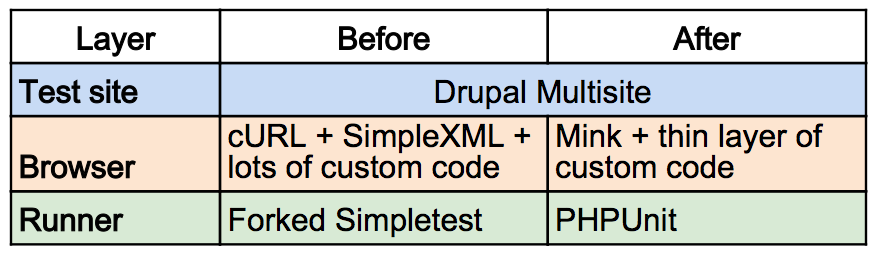

<!-- Begin assets -->
<link href="./assets/style.css" rel="stylesheet"></link>
<!-- End assets -->

# The Future of Drupal Functional Testing

---

## About the speakers

---

## NICK_SCHUCH/@WESOME1989



---

## Cameron Zemek



* Twitter/Drupal: grom358

---

## Questions

Who has written a test using..........?

---

## Thanks to the community


Note:
* Thankyou to the maintainers / coders
* Thanks everyone for coming so we can take Drupal testing forwards
* Thankyou to Simpletest

---

## What is functional testing



Note:
* Full stack testing
* If we were testing this reveal.js application...
* Types
 * Smoke - Wide array of functionality.
 * Sanity - Brief run of functionality.
 * Regression - Write it when something breaks.

---

## The state of Drupal testing


Note:
* Forked (Dries committed it on 21/04/2008)
* Simpletest last release was 23/01/2012
* Maintainers have to maintain this legacy testing system
* PHPUnit already adopted for Unit tests
* KernelTestBase -> Base class for integration tests, can access files and the database, but the entire environment is initially empty.
* WebTestBase. cURL + SimpleXML + custom code

---

## The state of Drupal testing - Cont...



Note:
* run-tests.sh
* WebTestBase::setUp() creates test site using Drupal Multisite
* WebTestBase using cURL + SimpleXML + custom code connects to test site. Secured via User-Agent string

---

## Time to get off the island


Note:
* Follow our current methodologies in core
 * Dries mention in his keynote
* BrowserTestBase -> PHPUnit + Mink + custom code

---

## PHPUnit


Note:
* PHPUnit is the standard; Zend Framework, Cake, even Symfony is dropping their own Framework in Symfony 2 for phpunit).
* Already using it in Drupal 8 with unit tests.
* PHPUnit handles running tests, reporting and code coverage.

---

## PHPUnit example

```
<?php
class StackTest extends PHPUnit_Framework_TestCase {
  public function testPushAndPop() {
    $stack = array();
    $this->assertEquals(0, count($stack));

    array_push($stack, 'foo');
    $this->assertEquals('foo', $stack[count($stack) - 1]);
    $this->assertEquals(1, count($stack));

    $this->assertEquals('foo', array_pop($stack));
    $this->assertEquals(0, count($stack));
  }
}
```

---

## PHPUnit - Contrib



---

## PHPUnit - Contrib for real

* **NSinopoli/VisualPHPUnit** - _A PHPUnit GUI_
* **sebastianbergmann/php-timer** - _Utility class for timing_
* **brianium/paratest** - _Parallel testing for PHPUnit_

Note:
* Pull from upstream
* Push our own projects

---

## Recognise this syntax

```
Scenario: The content page exists
  Given I am logged in as a user with the "administrator" role
  When I go to "contact-us"
  Then the response status code should be 200
  Then I enter "Cameron" for "name"
  And I enter "grom@pnx.me" for "mail"
  And I press "Send"
  Then I should see "Thanks for contacting us"
```

Note: Actually powered by Mink

---

## Mink


Note:
* Two types of browser emulators, Headless (Goutte) Browser Controller (Selenium2)
* Headless browsers - Simple, fast, less setup. No JS/AJAX
* Browser controllers - Real browser, but slow.
* Don't need to choose one, can use both with Mink.
* Mink does heavy lifing. Remove need for browser emulation code.
* Dries reducing cost

---

## Mink example

```
<?php
$driver = new \Behat\Mink\Driver\GoutteDriver();
$session = new \Behat\Mink\Session($driver);
$session->start();
$session->visit('http://localhost:8080');
$page = $session->getPage();
$el = $page->find('css', '#test');
echo $el->getText(), $el->getAttribute('href'), PHP_EOL;
$session->clickLink('Contact Us');
$session->fillField('name', 'John');
$session->fillField('message', 'Hello Amsterdam');
$session->pressButton('Email');
$session->stop();
```

---

## Did someone say JavaScript?


Note:
* Mouse manipulations: click, doubleClick, rightClick, mouseOver, focus, blur
* Drag & Drop: dragTo
* Not solution to javascript unit testing, but enable full stack testing that includes dynamic frontend
* Handle pages with AJAX

---

## PhantomJS


Note:
* PhantomJS is a headless WebKit scriptable with a JavaScript API. It has fast and native support for various web standards: DOM handling, CSS selector, JSON, Canvas, and SVG.
* Packaged in a binary.

---

## BrowserTestBase

* How it came to be https://www.drupal.org/node/2232861
* Try to port WebTestBase to Mink https://www.drupal.org/node/2274167#comment-8916585
* Mink for browser + PHPUnit for asserts.

Note:
* Relied on decorator and backwards compatibility layer
* Too many edge cases
* New plan of attack, start fresh

---

## Layers



Note:
* Massive reduction in code in the Browser and Runner layers
* Can use real browsers in the browser layer
* 1000+ lines of custom code implementing a Browser. Replaced with using Mink library.

---

## Show me the code

```
<?php
namespace Drupal\simpletest\Tests;

use Drupal\simpletest\BrowserTestBase;

class BrowserTestBaseTest extends BrowserTestBase {
  function testGoTo() {
    // Go to the front page and make sure we can see some text.
    $this->drupalGet('');
    $this->assertPageTextContains("Enter your Drupal username.");
  }
}
```

---

## Recommendations

* Replace the Runner/Framework with PHPUnit
* Replace the "Browser" with Mink
* Agree on a Javascript driver for core. Then we can start building the "driver" functionality. (Please come to the BOF!)
* Commit along side existing test suite. Start converting AJAX tests in core.

---

## How do we get this into Drupal 8 core

* https://github.com/nickschuch/drupal-phpunit-mink
* https://www.drupal.org/node/2232861

---

## Blockers

* Testing infrastructure.
 * Not easy to swap out run-tests.sh with phpunit
 * Hard to setup PhantomJS on testbot
* Please help those guys out! #drupal-infrastructure

---

## Checkout

* Modernizing testbot: The future of drupal.org automated testing (Wednesday 10:45-11:45)
* Automated Frontend testing (Wednesday 14:15-15:15)
* Doing behaviour driven development with behat (Wednesday 15:45-16:45)

---

## BOF

* **Time**: 2:15PM - 3:15PM
* **Room**: G001 · Lingotek

---

## Conversation time!


