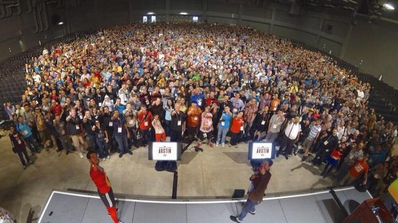
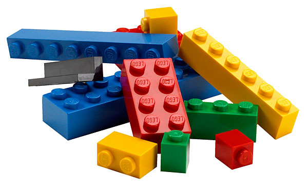
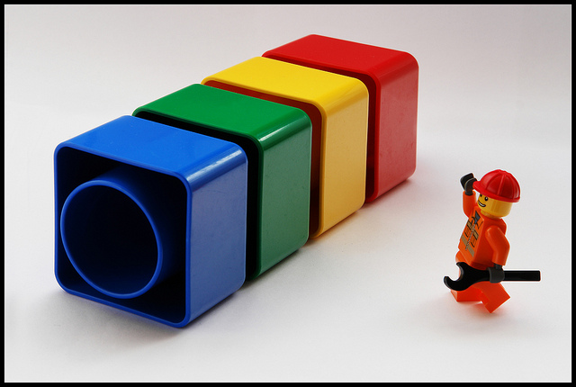

<!-- Begin assets -->
<link href="./assets/style.css" rel="stylesheet"></link>
<!-- End assets -->

# The Future of Drupal Functional Testing

---

## About the speakers

---

## Nick Schuch

---

## Cameron Zemek

* PHP developer for 10 years
* Drupal/Twitter: grom358

---

## Thanks to the community



Note:
* Thank simpletest, wouldn't have Drupal 8 without it
* Thanks everyone for coming so we can take Drupal testing forwards

---

## The state of Drupal testing


Note:
* Long ago forked from simpletest (Dries committed it on 21/04/2008)
* Simpletest last release was 23/01/2012
* Maintainers have to maintain this legacy testing system
* PHPUnit already adopted for Unit tests
* KernelTestBase -> Base class for integration tests, can access files and the database, but the entire environment is initially empty.
* WebTestBase. cURL + SimpleXML + custom code

---

## Not a replacement for unit testing



Note:
* Functional testing is a quality assurance (QA) process and a type of black box testing that bases its test cases on the specifications of the software component under test. Functions are tested by feeding them input and examining the output, and internal program structure is rarely considered (not like in white-box testing). Functional Testing usually describes what the system does.
* Functional Testing have many types:
** Smoke Testing - A subset of test cases that cover the most important functionality of a component or system is selected and run, to ascertain if the most crucial functions of a program work correctly.
** Sanity Testing - The point of a sanity test is to rule out certain classes of obviously false results, not to catch every possible error. The advantage of a sanity test, over performing a complete or rigorous test, is speed.
** Regression Testing - is a type of software testing that seeks to uncover new software bugs, or regressions, in existing functional and non-functional areas of a system after changes such as enhancements, patches or configuration changes, have been made to them.
** Usability Testing
* Higher level then unit testing, not dealing with API layer of modules. Working from exposed web interface.
* https://www.drupal.org/node/394888
* Tests are written in such a way that they test the interface as a whole instead of testing individual functions or finite pieces of code.
* Drupal is installed into that environment and the tests are performed. What this means is that the tests always start from the same environment and there is no chance for contamination from other tests. When you write your test it means that you do not have to clean up the environment at the end of each test.

---

## Time to get smarter about our tests



Unit -> DB -> HTTP -> Functional!!!

---

## Time to get off the island


Note:
* BrowserTestBase -> PHPUnit + Mink + custom code

---

## PHPUnit


---

## Recognise this syntax

```
Scenario: The content page exists
  Given I am logged in as a user with the "administrator" role
  When I go to "admin/content"
  Then the response status code should be 200
```

Note: Actually powered by Mink

---

## Mink


---

## Did someone say JavaScript?


---

## PhantomJS


---

## Show me the code

WE NEED TO WRITE SOME CODE!

---

## How do we get this into Drupal 8 core

Link to patch

---

## Checkout

* Modernizing testbot: The future of drupal.org automated testing (Wednesday 10:45-11:45)
* Automated Frontend testing (Wednesday 14:15-15:15)
* Doing behaviour driven development with behat (Wednesday 15:45-16:45)

---

## Question time!
